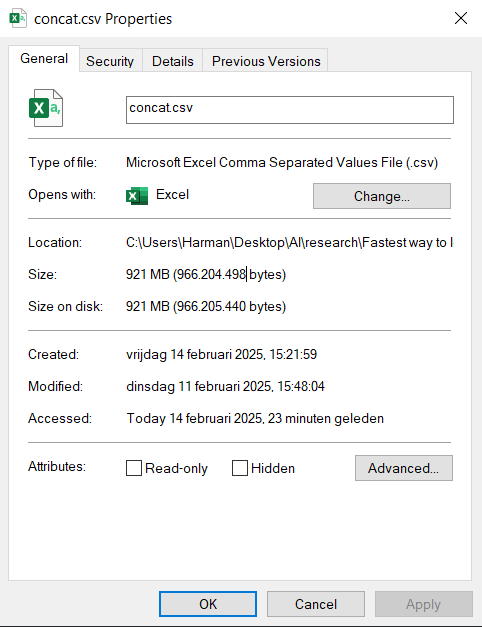

# Fastest way to handle large datasets in Python

## Methodology

- read data
- perform operations on data
- write data

## Libraries

- Pandas
- Pandas with PyArrow backend (parquet)
- Polars
- Polars with CUDA (always tested [in a different notebook](./gpu_accelerated/polars.ipynb), because it requires me to use WSL 2)

## Dataset

We use a concatenated version of the CICIDS2017 dataset. It is 921 MB in size

## Results

### Reading data

We simply read in the dataset

| Library                | Time (seconds) |
|------------------------|----------------|
| Pandas                 | 11.3736        |
| Pandas with PyArrow    | 1.8045         |
| Polars (CPU)           | 1.1111         |
| Polars with CUDA       | TO-DO          |

### Performing operations on data

We filter the dataset based on the `Destination Port` column, and then we sort it based on the `Destination Port` column

| Library                | Time (seconds) |
|------------------------|----------------|
| Pandas                 | 0.5041         |
| Pandas with PyArrow    | 0.6617         |
| Polars (CPU)           | 0.2960         |
| Polars with CUDA       | TO-DO          |

### Writing data

TO-DO